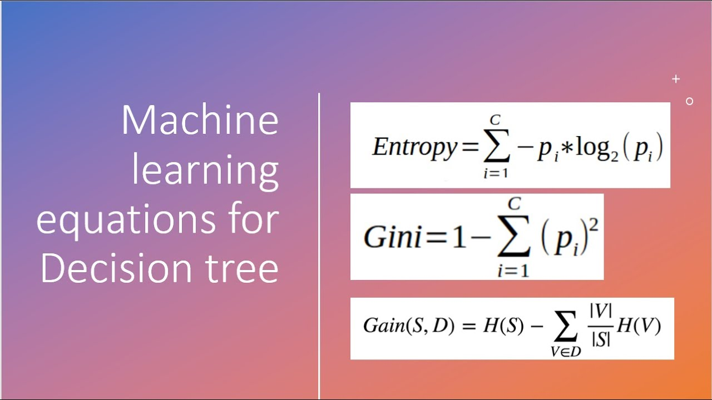

# Overview of Decision Tree Method - 

Decision Trees are a supervised learning algorithm used for classification and regression. They work by recursively splitting the dataset based on feature values to create a tree-like structure of decision rules. Each internal node represents a feature-based question, each branch represents the outcome of that question, and each leaf node represents a class label or prediction.

The model learns a hierarchy of decisions that lead to increasingly pure subsets of data, and the training process involves choosing splits that maximize information gain (e.g., Gini Impurity or Entropy reduction).

Unlike black-box models, decision trees are interpretable and well-suited for domains where understanding the reasoning process is crucial.

# Strengths

- Interpretable: You can visualize and extract human-readable rules from the tree.
- No Feature Scaling Needed: Unlike KNN or SVM, decision trees are invariant to feature scaling.
- Handles Non-linearity: Captures complex, non-linear relationships between features and target.
- Works on Categorical Features: No need to normalize or embed categorical variables when using tree-based methods.

# Weaknesses

- Overfitting: Trees can easily overfit, especially if not pruned or if the depth isn't limited.
- Instability: Small changes in data can lead to very different tree structures.
- Bias Toward Dominant Classes: Can be biased if the dataset is imbalanced and not weighted properly.

Decision Trees are best when:
- Interpretability is important.
- Data contains a mix of categorical and numerical features.
- There’s a need for fast inference after training.

# Implementation - 

Our decision tree implementation involved:

- Selecting a subset of the most distinguishing features: `'odor'`, `'gill-color'`, `'ring-type'`, and `'spore-print-color'`.
- Applying One-Hot Encoding to convert categorical features into binary columns.
- Splitting data into training and testing sets (70/30).
- Training a `DecisionTreeClassifier` from `sklearn` using default parameters.

We evaluated performance using:
- Accuracy: 97%
- Precision & Recall: Both edible and poisonous classes achieved \~0.97 F1-score.
- Confusion Matrix: Showed that the model slightly over-predicts the "poisonous" class — a safe failure mode in this application.

We visualized:
- The full decision tree with color-coded class nodes (green/blue for edible, red for poisonous).
- The decision rules extracted via `export_text()`.
- A 2D projection of the decision boundary using PCA, allowing us to understand how the model separates classes in reduced dimensions.
- The confusion matrix to highlight types of misclassifications.

# Overview of the Dataset - 
- We used the [UCI Mushroom Dataset](https://archive.ics.uci.edu/ml/datasets/mushroom) containing 8124 mushroom samples, each labled as either edible(e) or poisonous(p).
- All features are categorical, such as cap shape, gill color, and odor.
- Many of these features are strong predictors — especially odor, which almost perfectly separates the classes.

# To Replicate Results - 

- Just as all other methods, code blocks are implemented in the exact order that they should be executed, with instructions if applicable. I've ran the program from top to bottom, your results should be close to what I have written in the remarks. 
