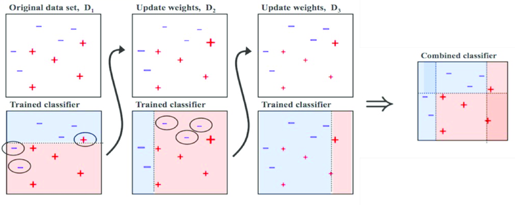

# Overview of AdaBoost Method –

AdaBoost is a sequential ensemble method that improves classification accuracy by combining multiple weak learners—typically shallow decision trees (stumps)—into a strong learner. Unlike bagging methods like Random Forest, AdaBoost adjusts the weights of training examples so that subsequent classifiers focus more on the samples that were previously misclassified.

The core idea is to iteratively train weak models, and at each step, increase the influence (weight) of misclassified points in the loss function. The final prediction is a weighted majority vote (or weighted sum for regression) of all the weak learners. AdaBoost is particularly effective for datasets with noisy labels and outliers, although it is sensitive to them when weak learners overfit.

# Overview of Gradient Boosting Method –

Gradient Boosting is a powerful boosting technique that builds models sequentially by minimizing a loss function using gradient descent. Like AdaBoost, it combines weak learners (typically shallow trees), but it does so by fitting new models to the residuals (errors) of the previous ensemble, rather than adjusting sample weights.

At each iteration, the model fits a new learner to the gradient of the loss function with respect to the prediction, effectively learning how to correct past mistakes. This allows Gradient Boosting to generalize well and adapt to both classification and regression tasks

# Overview of the Dataset - 

- As with Perceptrons, this project uses the [Titanic Survival Data](https://www.kaggle.com/datasets/uciml/ breast-cancer-wisconsin-data) dataset. We will implement AdaBoost and Gradient Boosting on survival data of passengers aboard the Titanic. Each passenger includes their survivorship status(0 - didn't survive, 1 - survived), and various attributes such as PassengerId, Survived, Pclass, Name, Sex, Age, SibSp, Parch, Ticket, Fare, Cabin, Embarked. 

- Based on some choice/combinations of the attributes, we'll try to predict the survival of the passengers

- Stored in the 'data' folder in the main Repo and referenced automatically

# To Replicate Results - 

- Just as all other methods, code blocks are implemented in the exact order that they should be executed, with instructions if applicable. I've ran the program from top to bottom, your results should be close to what I have written in the remarks. 