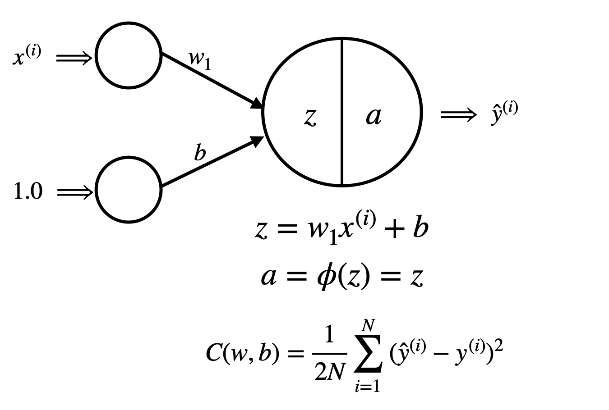

# Overview of Linear Regression Method

Linear regression is a foundational supervised learning technique used for predicting a continuous output based on one or more input features. It assumes a linear relationship between the input(s) and the target variable. That is, the model predicts the output as a weighted sum of the inputs plus a bias term.

This method is grounded in the principle of minimizing the mean squared error (MSE) between predicted values and actual outputs. We achieve this by iteratively updating weights using gradient descent, a process where the model takes small steps in the direction that reduces the overall prediction error.

Our model implementation uses a simplified structure:

- A single neuron with a linear activation function, capable of learning the best-fit line through the data.

- Gradient descent is applied to optimize the weights over multiple epochs, adjusting the model as it "learns" from the data.

The core components of linear regression are:

- Weighted sum: Computes the linear combination of inputs and their weights.
- Cost function: Measures the discrepancy between predicted and true values (MSE in our case).
- Gradient descent: Optimization method to minimize the cost by adjusting weights over time.

Linear regression is best suited for problems where a linear relationship exists between input and output. When the data exhibits nonlinear trends, transformations (e.g., log transform) or more complex models may be required, otherwise forcing a linear model onto a nonlinear trend will result in non-randomly distributed errors, and a compromised model.

# Overview of the Dataset - 
- This project uses the ([Fish Market Dataset](https://www.kaggle.com/datasets/vipullrathod/fish-market)), where each row describes physical measurements of a fish (such as Width, Height, Length) and its weight.

- The target variable, Weight, is transformed using a log function (log(Weight)) to account for nonlinear scaling observed in initial visualizations.

- The dataset is cleaned to remove any rows with missing or zero values in the attributes, ensuring model reliability.

# To Replicate Results - 
- Just as all other methods, code blocks are implemented in the exact order that they should be executed, with instructions if applicable. I've ran the program from top to bottom, your results should be close to what I have written in the remarks. 

- Since I ran the analysis on two seperate parts of the data, clearing the cache and rerunning from the beginning should resolve any issues that may arise

- Feel free to adjust the global variable - it'll result in a slightly different, but still very simiar result to mine.