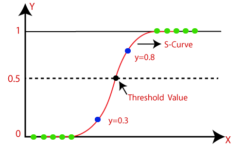
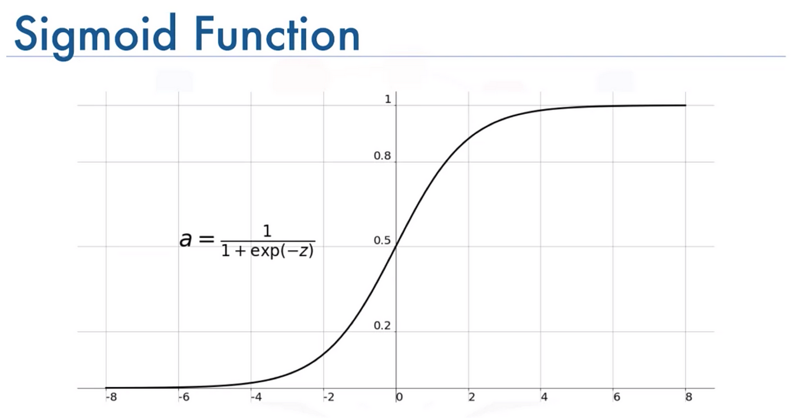

# Overview of Logistic Regression Method

Logistic regression is a fundamental supervised learning algorithm used for binary classification problems. Instead of predicting a continuous outcome, it estimates the probability that a given input belongs to a particular class (e.g., malignant vs. benign tumors).

It does so by applying the sigmoid (logistic) function to a weighted sum of inputs, converting any real-valued number into a range between 0 and 1—interpretable as probability.

The model is then trained using binary cross-entropy loss, which penalizes incorrect predictions more strongly as they become more confident. We use stochastic gradient descent (SGD) to iteratively update the model’s weights and minimize this loss function.

Strengths
- Interpretability: Each feature’s coefficient can be directly interpreted as its influence on the log-odds of the outcome, making the model highly transparent and explainable—critical in regulated or high-stakes environments like healthcare or finance.

- Efficiency: Logistic regression is computationally light and converges quickly, making it suitable for small to moderately sized datasets.

- Probabilistic Output: Unlike hard classifiers, logistic regression provides predicted probabilities, which can be useful in risk-based or threshold-sensitive decision systems.

Weaknesses
- Linear Decision Boundary: The model is limited to learning linear boundaries in feature space. It may perform poorly on problems where the true decision surface is non-linear unless non-linear transformations or interactions are manually introduced.

- Sensitivity to Outliers: As with most linear models, logistic regression is vulnerable to extreme values, which can disproportionately skew the decision boundary.

- Assumption of Feature Independence: Correlated (multicollinear) features can lead to unstable or misleading coefficient estimates.

Given its strength and weaknesses, its most appropriately used when :
- The outcome variable is binary.
- The relationship between predictors and outcome is approximately linear in log-odds.
- The dataset is relatively clean, with limited multicollinearity and no severe outliers.

In summary, logistic regression remains a powerful yet simple method for binary classification problems, especially when interpretability and speed are prioritized over capturing complex nonlinear relationships

# Implementation

Our model implementation build a single neuron model that:

- Applies a sigmoid activation function to the linear combination of inputs.
- Uses binary cross-entropy as the cost function.
- Optimizes weights via gradient descent with per-sample updates (SGD).

The model is then trained as following

- Standardizing the input feature with StandardScaler.

Training the model over 100+ epochs and tracking the loss over time.

Evaluating predictions using accuracy, F1 score, and a classification report.

Visualizing the confusion matrix and the sigmoid prediction curve.

# Overview of the Dataset - 
- This project uses the ([Wisconsin Breast Cancer](https://www.kaggle.com/datasets/uciml/breast-cancer-wisconsin-data)) data, where each row describes physical measurements of a cancer diagnosis such as its radius, area, texture, concave point, and the dependent variable Diagnosis(with 0 for Malignant and 1 for Benign)

- We standarize the input feature with StandardScaler.

- The attributes are screened visually and empirically to find the most suited to be used for the regression

# To Replicate Results - 
- Just as all other methods, code blocks are implemented in the exact order that they should be executed, with instructions if applicable. I've ran the program from top to bottom, your results should be close to what I have written in the remarks. 
