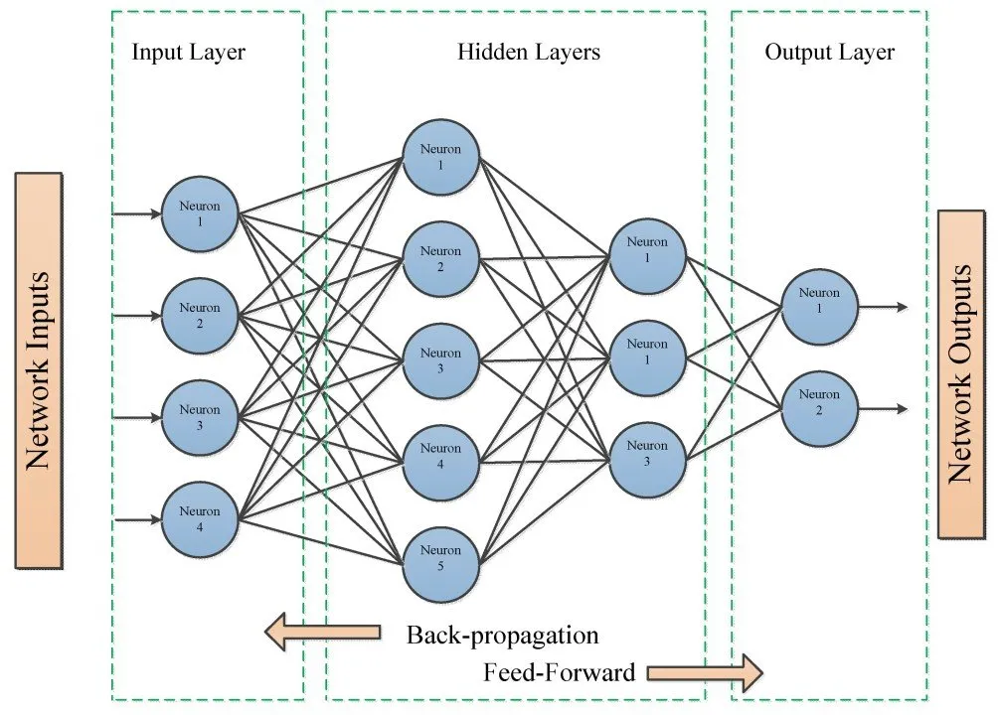
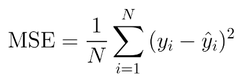

# Overview of Neural Network Method -

A neural network is a computational model consisting of interconnected nodes (neurons) organized into layers. Neural networks are particularly effective in handling complex, non-linear relationships in data and are widely used in tasks like image recognition, natural language processing, and time-series forecasting.

Our implementation focused on a fully connected feedforward neural network, trained to perform multi-class classification on images of cloths. The network consists of an input layer (784 nodes corresponding to 28×28 pixel images), multiple hidden layers (to capture non-linear feature interactions), and an output layer with 10 nodes, each representing one digit class.

Each neuron computes a weighted sum of its inputs, passes it through a non-linear activation function (sigmoid), and forwards the result to the next layer. During training, the network uses stochastic gradient descent (SGD) to iteratively adjust weights and biases in order to minimize the prediction error measured by mean squared error (MSE).

# Strengths
- Custom Implementation: Building the neural network from scratch in NumPy deepened understanding of forward propagation, backpropagation, and training dynamics.

- Learning Capability: The model showed the ability to reduce training error significantly across epochs, indicating successful learning of underlying patterns.

- End-to-End Workflow: Included complete steps from preprocessing to training, evaluation, and visualization, providing a holistic machine learning pipeline.

# Weaknesses
- Choice of Loss Function and Activation: Using MSE with sigmoid is suboptimal for multi-class classification. A better choice would be cross-entropy with softmax, which aligns with the probabilistic nature of classification.

- Collapsed Predictions: After training, the model consistently predicted a single digit ("2") regardless of input. This is a strong indicator of poor generalization, likely caused by:

- Vanishing gradients from sigmoid activations.

- Potential issues in weight initialization or learning rate.

- Inappropriate loss for classification tasks.

- No Accuracy or Confusion Matrix Metrics: Relying solely on MSE gives limited insight into actual classification performance.

# Overview of the Dataset - 

- As with Perceptrons, this project uses the [Fasion MNIST](https://www.kaggle.com/datasets/zalando-research/fashionmnist) dataset. We will implement a dense neural network on the dataset to learn to identify different types of cloths from 28x28 matricies representing the pixel values of the images. 

- inported directly from TensorFlow, no need to download anything

# To Replicate Results - 

- Just as all other methods, code blocks are implemented in the exact order that they should be executed, with instructions if applicable. I've ran the program from top to bottom, your results should be close to what I have written in the remarks. 