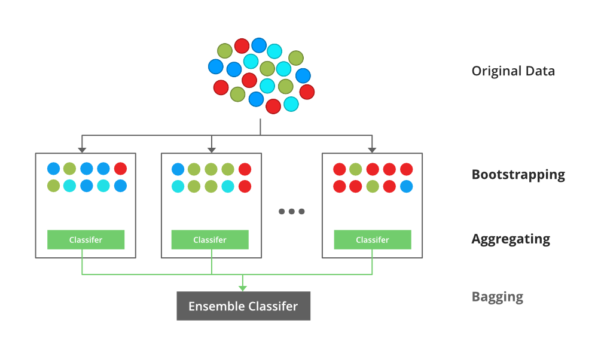

# Overview of Random Forest Method - 

Random Forest is an ensemble learning technique primarily used for classification and regression tasks. It works by constructing multiple decision trees during training and combining their predictions to make a final decision. Each tree in the forest is trained on a random subset of the data, and the final prediction is made by averaging the outputs (for regression) or through majority voting (for classification).

Random Forest operates on the principle of bagging (Bootstrap Aggregating), where multiple subsets of the training data are sampled with replacement to create diverse trees. This diversity reduces the risk of overfitting, making Random Forest more robust compared to a single decision tree.

Random Forest is well-known for its out-of-bag (OOB) error estimation method, where unused samples during tree construction are tested to provide a performance estimate, allowing for more efficient model validation.

# Strengths

- Robustness to Overfitting: By averaging the results of multiple decision trees, Random Forest reduces the likelihood of overfitting compared to individual decision trees.

- High Accuracy: Random Forest is known for delivering high predictive accuracy, especially when compared to simpler models like decision trees, as it combines the strengths of multiple classifiers.

- Feature Importance: Random Forest can rank the importance of different features based on how much they contribute to reducing the impurity in the trees, providing valuable insights into the data.

- Handles Missing Data: Random Forest can handle missing data by using surrogate splits during tree construction, making it more versatile in real-world applications.

- Works Well with Both Categorical and Continuous Variables: Random Forest can effectively handle both types of features without requiring data transformation.

# Weaknesses

- Complexity and Interpretability: While Random Forest is highly accurate, it is more challenging to interpret than individual decision trees. The black-box nature of Random Forest makes it difficult to explain the model's decision process.

- Computationally Expensive: Training multiple trees in the forest requires substantial computational resources, especially when dealing with large datasets.

- Memory Usage: The model can become memory-intensive, especially when the number of trees and data samples is large.

- Slow Prediction Time: Since multiple trees must be queried for each prediction, Random Forest can be slow at inference time, especially in real-time prediction applications.

Random Forest is most appropriate when:

- The dataset is large, with both numerical and categorical features.
- A robust model is needed that is resistant to overfitting.
- The relationship between features and the target variable is complex and non-linear.
- Interpretability is not a primary concern.

# Implementation -

Our Random Forest implementation for the Titanic survival prediction involved:

- Preprocessing:

  - Handling missing values by imputing with the median for numerical features and the mode for categorical ones.
  - Converting categorical features like Sex and Embarked into numerical representations using one-hot encoding.
  - Scaling features to ensure all attributes contribute equally to the model's decision-making process.

- Model Training:

  - We used the `RandomForestClassifier` from `sklearn` to train the model with 100 trees (estimators) and a random subset of features at each split.
  - Hyperparameters were fine-tuned for optimal performance using cross-validation.

- Model Evaluation:

  - We evaluated the model using metrics like accuracy, precision, recall, and f1-score to assess its ability to predict survival.
  - We also used a confusion matrix to visualize the model's classification performance.

We visualized:

- Confusion Matrix: Showing the true positives, false positives, true negatives, and false negatives, giving us insights into classification accuracy.

- Feature Importance: A plot displaying the importance of each feature in predicting survival. Age, Fare, and Sex were identified as the most influential features.

# Overview of the Dataset - 

- As with Perceptrons, this project uses the [Titanic Survival Data](https://www.kaggle.com/datasets/uciml/ breast-cancer-wisconsin-data) dataset. We will implement Random Forest on survival data of passengers aboard the Titanic. Each passenger includes their survivorship status(0 - didn't survive, 1 - survived), and various attributes such as PassengerId, Survived, Pclass, Name, Sex, Age, SibSp, Parch, Ticket, Fare, Cabin, Embarked. 

- Based on some choice/combinations of the attributes, we'll try to predict the survival of the passengers

- Stored in the 'data' folder in the main Repo and referenced automatically

# To Replicate Results - 

- Just as all other methods, code blocks are implemented in the exact order that they should be executed, with instructions if applicable. I've ran the program from top to bottom, your results should be close to what I have written in the remarks. 