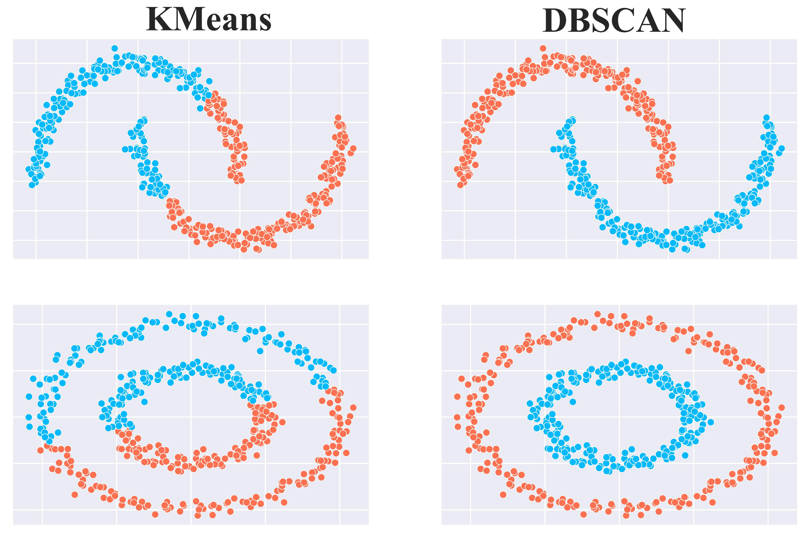

# Overview of DBSCAN (Density-Based Spatial Clustering of Applications with Noise) 

DBSCAN is an unsupervised machine learning algorithm that identifies clusters based on the density of data points in a given region. Unlike centroid-based methods like K-Means, DBSCAN groups together points that are closely packed while marking points in low-density regions as noise. This makes DBSCAN particularly useful for datasets with clusters of arbitrary shapes and varying densities.

The DBSCAN algorithm works by the following steps:

- Core Points: A point is classified as a core point if it has at least a minimum number of points (min_samples) within a given distance (eps).

- Neighborhood Search: For each core point, DBSCAN examines its neighborhood (within a radius of eps) to find nearby points. Points that fall within this neighborhood are assigned to the same cluster.

- Cluster Expansion: Once a core point is identified, DBSCAN expands the cluster by recursively including points within the neighborhood of each new point.

- Noise Points: Points that do not meet the density criteria of being within a core point’s neighborhood are labeled as noise.

# Key Advantages:

- No need to specify the number of clusters: Unlike K-Means, DBSCAN does not require the number of clusters (k) to be predefined.

- Can detect arbitrarily shaped clusters: DBSCAN is well-suited for datasets where clusters are of non-spherical shape, as opposed to K-Means which assumes circular clusters.

- Handles noise well: The ability to label points as noise is a unique strength, making DBSCAN robust in the presence of outliers.

Despite its advantages, DBSCAN has limitations such as:

- Sensitive to parameter choice: The algorithm’s performance is highly dependent on the eps and min_samples parameters. Improper choice of these can result in poor clustering or misclassification of noise points.

- Struggles with varying densities: If the dataset contains clusters with varying densities, DBSCAN may struggle to identify them correctly.

# Overview of the Dataset

- This project uses the [Mall Customer]("https://www.kaggle.com/datasets/vjchoudhary7/customer-segmentation-tutorial-in-python") dataset, available on Kaggle. 

- We try to classify customers visiting the mall into groups based on spending power, gender, shopping habbits, in order to better personalize shopping experience 

# To Replicate Results - 

- Just as all other methods, code blocks are implemented in the exact order that they should be executed, with instructions if applicable. I've ran the program from top to bottom, your results should be close to what I have written in the remarks. 
