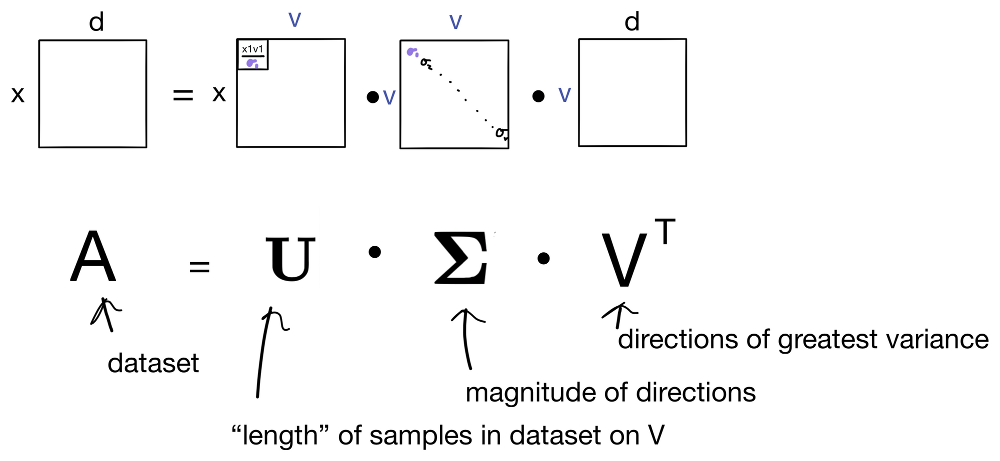
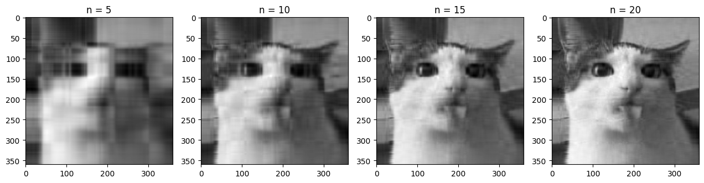

# Overview of Singular Value Decomposition in Image Compression(SVD)

Singular Value Decomposition is a matrix factorization method that decomposes a matrix A, like following: 

In the context of image compression, an image is represented as a matrix where each entry corresponds to the intensity of a pixel. By applying SVD, we can approximate the original image using only the most significant singular values, reducing the number of components needed to represent the image.

# Overview of the Dataset

- A picture of my Golden Retriever, Alice!

# To Replicate Results - 

- Just as all other methods, code blocks are implemented in the exact order that they should be executed, with instructions if applicable. I've ran the program from top to bottom, your results should be close to what I have written in the remarks. 
