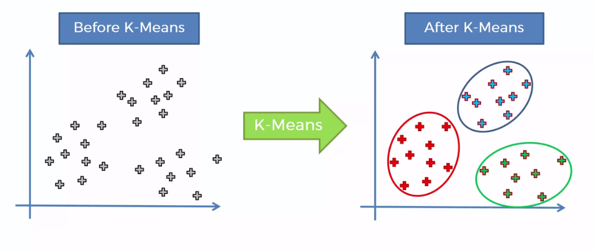

# Overview of K-Means Clustering (KMC) - 

K-Means Clustering (KMC) is a widely used unsupervised learning algorithm for partitioning a dataset into k distinct clusters. The objective of K-Means is to assign each data point to one of k clusters based on the feature similarity, such that the sum of squared distances between the points and their corresponding centroids is minimized. It is a centroid-based algorithm, where each cluster is represented by the mean (centroid) of the points within it.

The K-Means algorithm works iteratively through the following steps:

1. Initialization: Randomly select k data points as initial centroids.
2. Assignment: Assign each data point to the nearest centroid based on a distance metric, typically Euclidean distance.
3. Update: Recalculate the centroids of the newly formed clusters by computing the mean of the points assigned to each cluster.
4. Repeat: Repeat the assignment and update steps until the centroids converge (i.e., no significant change in the centroids) or a predefined number of iterations is reached.

K-Means is often used for:

- Data segmentation: Grouping similar data points together, commonly used in customer segmentation, image compression, and market research.
- Pattern recognition: Identifying patterns and structures in unlabeled data.
- Preprocessing for other algorithms: K-Means can be used to initialize centroids for other clustering or classification algorithms.

Despite its simplicity, K-Means has some limitations, such as sensitivity to the initial placement of centroids and difficulty in handling clusters of varying shapes and densities.

# Overview of the Dataset - 

- This project uses the Wine dataset, available through SKlearn, to demonstrate its power to both reduce dimentionality while preserving power.

# To Replicate Results - 

- Just as all other methods, code blocks are implemented in the exact order that they should be executed, with instructions if applicable. I've ran the program from top to bottom, your results should be close to what I have written in the remarks. 
