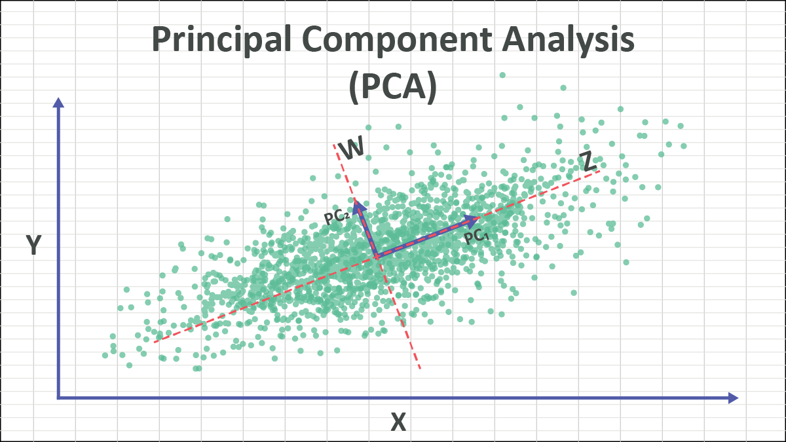

# Overview of Principal Component Analysis (PCA)

Principal Component Analysis(PCA) is a dimensionality reduction technique used to reduce the number of features in a dataset while preserving as much variance as possible. PCA is commonly applied in unsupervised machine learning to simplify data, making it easier to visualize, analyze, or model. It transforms the data into a set of orthogonal (uncorrelated) components, known as principal components, ordered by the amount of variance they explain.

The goal of PCA is to find the directions (principal components) in which the data varies the most and project the data onto these new axes. The first principal component accounts for the most variance, the second one for the next most variance, and so on. This is achieved through an eigenvalue decomposition of the covariance matrix of the dataset or by Singular Value Decomposition (SVD).

PCA is often used for:

- Noise reduction: By retaining only the most important components.
- Visualization: Reducing data to 2D or 3D for easier interpretation, particularly in high-dimensional datasets.
- Preprocessing: Enhancing the performance of machine learning algorithms by removing correlations between features and reducing computational complexity.

# Overview of the Dataset

- This project uses the Wine dataset, available through SKlearn, to demonstrate its power to both reduce dimentionality while preserving power.

# To Replicate Results - 

- Just as all other methods, code blocks are implemented in the exact order that they should be executed, with instructions if applicable. I've ran the program from top to bottom, your results should be close to what I have written in the remarks. 
